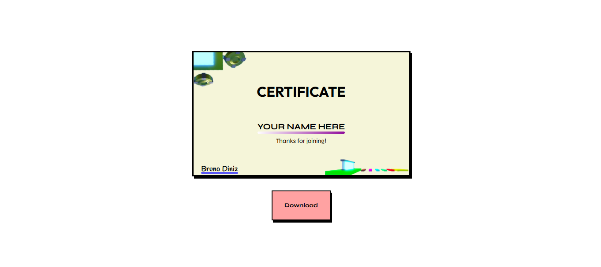

# Certificate Maker
My project is just something I did for a group of friends; I decided to create a certificate for them using my web development skills.

# How To use it?
The code asks for the name to appear on the certificate; there is also a button to save the certificate to your device!